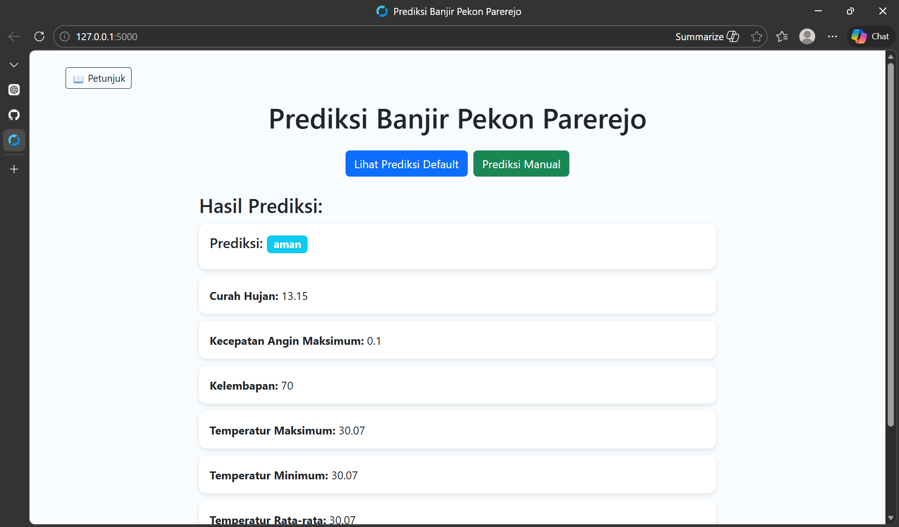

# 🌧️ Flood Prediction Web Application

A web-based flood prediction system developed as part of **Practical Work (Kerja Praktek)** in my village.
This application predicts potential flood conditions using weather data and a **Decision Tree Machine Learning model**.

The system retrieves weather forecast data from the OpenWeather API and processes several climate parameters to estimate flood risk levels.

---

## 📌 Features

* Fetch real-time weather data using OpenWeather API
* Flood prediction using a Decision Tree model
* Display important environmental parameters:

  * Humidity
  * Temperature
  * Dew Point
  * Wind Speed
  * Rainfall
* Simple web interface for viewing prediction results

---

## 🛠️ Technology Stack

* Python
* Flask
* Scikit-learn
* Joblib
* OpenWeather API
* HTML & CSS

---

## 📂 Project Structure

```
flood-predict
│
├── app.py
├── decisiontree.py
├── decision_tree_banjir.pkl
├── data_iklim_parerejo.csv
├── requirements.txt
│
├── static
│   └── style.css
│
├── templates
│   └── index.html
│
└── assets
    └── web-preview.png
```

---

## 🖥️ Application Preview



---

## ⚙️ Installation

Clone repository:

```
git clone https://github.com/USERNAME/flood-prediction.git
```

Install dependencies:

```
pip install -r requirements.txt
```

Create `.env` file for API key:

```
OPENWEATHER_API_KEY=your_api_key
```

Run the application:

```
python app.py
```

Open in browser:

```
http://127.0.0.1:5000
```

---

## 📊 Prediction Output

The system produces three possible prediction results:

* **Aman** → Normal conditions
* **Siaga** → Potential flood risk
* **Banjir** → High flood risk

---

## 🎯 Project Purpose

This project was developed to demonstrate the implementation of **Machine Learning and Web Technology** for environmental monitoring at the village level as part of my **Practical Work (Kerja Praktek)**.

---

## 👨‍💻 Author

Developed by **Nur Rahmawati**.